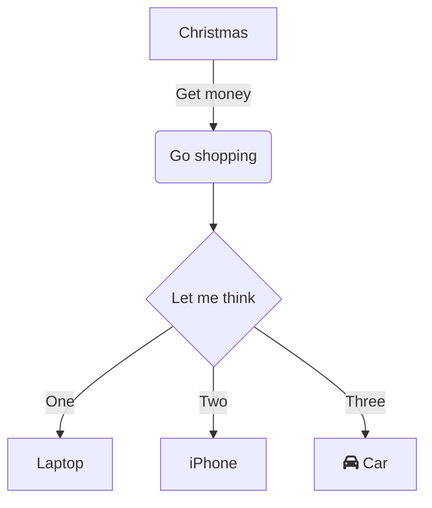
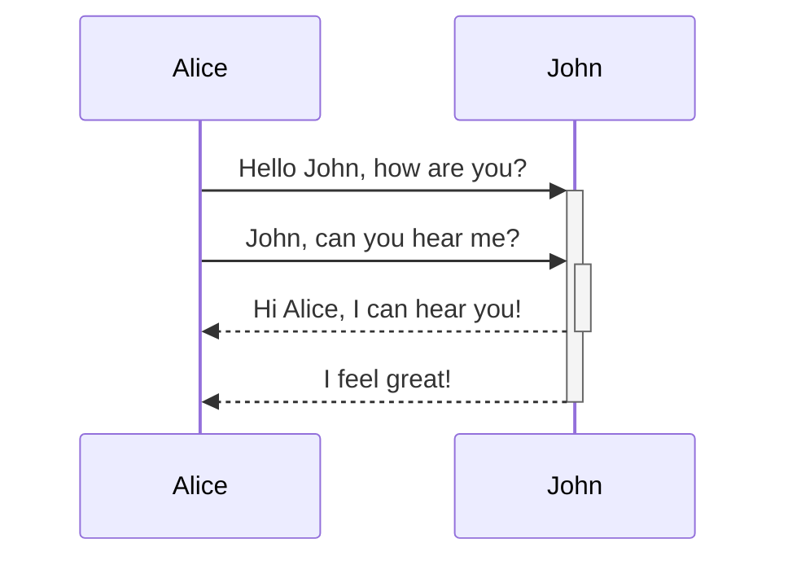
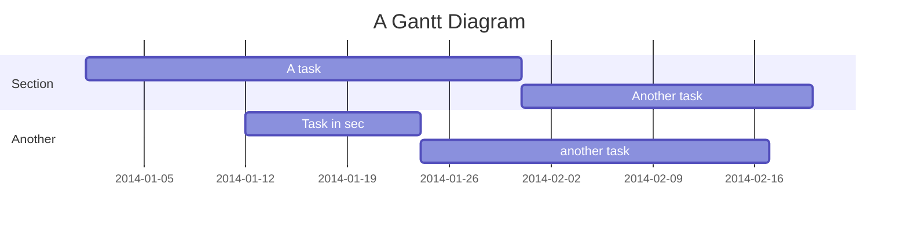

## 개요


이번 포스팅에서는 마크다운 문서에서 도표나 그림을 그려주는 mermaid라는 라이브러리를 소개하도록 하겠다.


## 설치


Typora와 같은 경우, 기본 내장이 되어있어서 굳이 설치를 안해도 된다.

만약 티스토리와 같은 서비스에서 사용하려면 다음 코드를 추가해주면 된다.


```html
<script src="https://cdnjs.cloudflare.com/ajax/libs/mermaid/8.4.4/mermaid.min.js"></script>
<script>mermaid.initialize({startOnLoad:true});</script>
```


## 예제


아래 예제는 그래프를 그리는 예제이다.





아래 예제는 시퀸스 다이어그램을 그려주는 예제이다.





아래 예제는 간트 차트를 그려주는 예제이다.





이 외에도, pie chart, 클래스 다이어그램 등을 그릴수도 있다.


## 유사품


유사한 제품(?) 으로 아래와 같은것들이 존재한다.

- Graphviz(dot)
- MXGraph


웹에서 에디터로 바로 편집도 가능하다(https://mermaid-js.github.io/mermaid-live-editor/)

