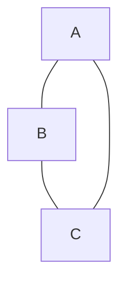

## 개요


이번 포스팅에서는, 자료 구조에서 그래프를 모델링 하는 방법들에 대해서 알아보도록 하겠습니다.


## 그래프?


그래프는 정점(Vertex) 와 간선(Edge)로 이루어진 자료 구조 입니다.


보통 수학적으로는 아래와 같이 표기하게 됩니다.


```latex
G = (V, E)
V = {A, B, C}
E = {(A,B),(B,C),(A,C)}
```


즉, 위의 설명을 그림으로 나타내면 아래와 같습니다.





보통 위와 같은 형태의 자료구조를 그래프 라고 부릅니다.


또한 그래프의 종류에는 방향 그래프와, 무방향 그래프 2종류가 존재합니다.


방향 그래프는 A -> C, C -> A 와 같이 서로 방향이 존재하는 그래프를 가리킵니다.

무방향 그래프는 반면에 A -> C, C -> A 를 따로 구분 하지 않는 방향이 없는 그래프를 가리킵니다.


이제 그럼, 그래프를 어떻게 프로그래밍 적으로 모델링을 하는지 알아보도록 하겠습니다.


## 1. 인접 행렬


먼저 인접 행렬 방식입니다. 

해당 방식은 말 그대로 A = M*N 배열의 형태로 그래프를 모델링 하는 방법입니다.


그런 뒤, i -> j 로 가는 길이 있으면, A(i,j) = 1, 아닌 경우 A(i,j) = 0 으로 표시하는 방식입니다.


보통 2차원 배열 또는 리스트로 모델링이 가능합니다.


위의 그래프를 파이썬을 이용해서 인접행렬 방식으로 나타내면 아래와 같습니다.


```python
A = [
  [0,1,1],
  [1,0,1],
  [0,1,1],
]
```


위 방식의 장/단점은 아래와 같습니다.

1. 장점 : 구현이 간편하고, 특정 경로가 존재하는지를 빠르게 찾을 수 있다. O(1)
2. 단점 : 메모리를 많이 먹는다.


## 2. 인접 리스트


다음으로, 인접 리스트 방식입니다. 

해당 방식은 그래프의 한 정점 에서 연결되어 있는 정점 들을 하나의 리스트로 표현하는 방법입니다.


즉, 아래와 같은 방식으로 표시 합니다.


```
A : [B, C]
B : [C, D]
C : [D, E, F]
```


즉, 위의 인접 리스트를 예시를 들면

A는 B,C 와 연결 되어 있고, B는 C,D 랑 연결 되어 있고, C는 D,E,F 랑 연결이 되어 있는것입니다.


보통 리스트의 배열 또는, 리스트의 해시 테이블로 모델링이 가능합니다.


위의 그래프를 파이썬을 이용해서 인접리스트 방식으로 나타내면 아래와 같습니다.


```python
A = {
  A : [B,C],
  B : [C,A],
  C : [A,B],
}
```


위 방식의 장/단점은 아래와 같습니다.

1. 장점 : 메모리를 인접 행렬 방식에 비해 적게 먹는다.
2. 단점 : 특정 경로가 존재하는지를 찾는데에 인접행렬 방식보다 오래 걸린다 : O(N)


## 3. 기타


그 외에도, [간선 리스트](https://en.wikipedia.org/wiki/Edge_list) 와 같은 방법들이 있습니다.


## 출처


1. https://en.wikipedia.org/wiki/Adjacency_list
2. https://en.wikipedia.org/wiki/Adjacency_matrix